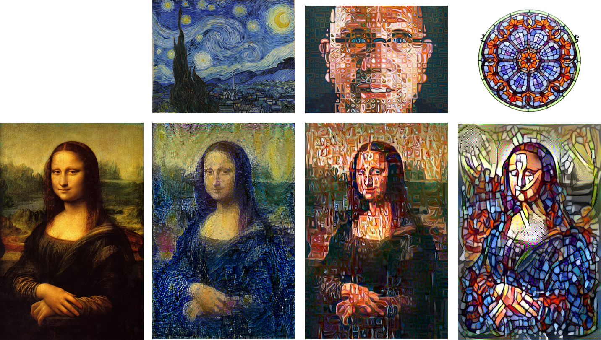

# Neural style transfer demo



[Neural style transfer](https://en.wikipedia.org/wiki/Neural_Style_Transfer) refers to the algorithmic application of the visual "style" from one image to another while preserving the general "content" of the original image.  In this context, "style" means textures, colors, and visual patterns while content would refer to the high-level macrostructure of the image.  Above is an example of a source image (the [Mona Lisa](https://en.wikipedia.org/wiki/Mona_Lisa)) thats had the style transfered from: (left to right) [The Starry Night](https://en.wikipedia.org/wiki/The_Starry_Night), [Chuck Close](http://chuckclose.com/)'s self portrait, and a stained glass window.


The above figure adapted from [Gatys et al. (2015)](https://arxiv.org/abs/1508.06576) illustrates the image processing flow during style transfer.  With each successive step, a defined loss function is reduced to preserve the content of the source image while effectively transferring a visual style to it.

Here, the VGG19 neural network ([Simonyan & Zisserman, 2014](https://arxiv.org/abs/1409.1556)) is used.

Example images and their resultant style transfered output can be found in the *test-images* and *output* directories, respectively.  Some of these tests turned out extremely well!

## Dependencies

  * [Keras](https://keras.io/)
  * [SciPy](https://www.scipy.org/)
  * [imageio](https://imageio.github.io/)
  * [numpy](http://www.numpy.org/)

You can use [pip](https://pypi.python.org/pypi/pip) to install any missing dependencies.

## Basic Usage

This code takes takes a target image and applies the style of a user supplied style image to it.  The script is executed by running:

```
python style-demo.py target-image.jpg style-image.jpg
```

An image of each step of the style transfer process is saved in the *output* directory.  For desired effect, the end user may have to tweak some user editable variables declared at the top of the *style-demo.py* script.  These include image size and style vs content weights.

## Acknowledgements

This demo is yet another implementation of neural style transfer as described in [Gatys et al. (2015)](https://arxiv.org/abs/1508.06576).  Image post-processing constants and layer choice was based on code examples in [Francois Chollet's book](https://www.manning.com/books/deep-learning-with-python).
